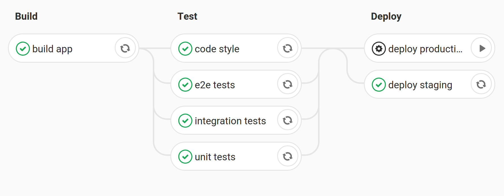
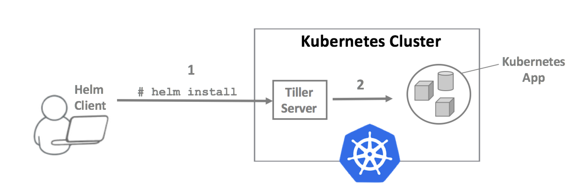

## From 0 to
## Continuous Deployment

**with Kubernetes, Helm and GitLab**

<small>by Stefano Torresi</small>

------

### Continuous Integration, Delivery and Deployment

- Merge changes into a shared mainline previa automated integration checks
- Keep mainline in a production-ready state
- Deploy mainline automatically

---

### But why?

- Foster collaboration
- Enforce best practices
- Grant confidence and safety
- Collect metrics about source code

_"Release early, release often"_

Notes:
See "The Cathedral and the Bazaar" by Eric S. Raymond

---

### The pipeline



---

### Let's build something

_Demo_

Notes:
Show a dockerized app running with docker-compose and its Gitlab CI config  
Mention [Gitlab CI docs](https://docs.gitlab.com/ee/ci/)

------

## Kubernetes

- Container orchestration platform
- Infrastructure abstraction
- Automates container coordination and management
- API driven, declarative, transparent

Notes:
- Born from Google's Borg, which was written in C++ instead of Go.
- Donated to CNCF in 2014
- The API is fully transparent in the sense that there are no hidden internal details. This allows a very high degree of flexibility.

---

### Kubernetes Architecture


Notes:
- Losely-coupled, master-worker
- Cluster centric, as opposed to how Docker Swarm is designed, which scales out from a single Docker host and then incrementally joining others.
- Master is a.k.a. the cluster control plane.
- etcd is used as the central cluster data storage.
- The `cloud-controller-manager` interacts with cloud specific details via dedicated controllers, when hosting Kubernetes on a cloud provider.
- Minions are handled by the `Kubelet` agent
- `Kube-Proxy` handles the networking abstractions.
- Master components are usually all run on the same node, which is separated from worker nodes, but this is ultimately an implementation detail. Minikube, for example, runs everything on one single node.
- HA deployments of the Master involve clustering etcd and load balancing the API server.

---


---

### Caveat Emptor

- Very high cognitive overhead
- Operating the Control Plane requires significant effort
- Easy to learn, hard to master
- Soft multi-tenancy

Notes:
Hard multi-tenancy can be achieved by having one cluster per tenant

---

### Managed Control Plane to the rescue

AKS, GKE, EKS, DOKS, ICKS... all the Ks!!


---

### Managed master to the rescue

```shell
gcloud container clusters create foobar
```

```shell
doctl kubernetes cluster create foobar
```

```shell
aws eks create-cluster --name foobar    # sort of... ;)
```

Notes:
Skipping CLI options for brevity, but AWS is actually not as easy as just running a command.

---

_Demo time_

Notes:
```shell
kubectx do-fra1-demo

kubectl cluster-info

doctl kubernetes cluster get demo -o json | jq

kubectl get nodes -w

kubectl create deployment nginx --image=nginx

kubectl expose deployment nginx \
    --port=80  \
    --type=LoadBalancer

kubectl get service nginx -w

kubectl get deployment nginx -o yaml
kubectl get service nginx -o yaml
```

---

### Whole lotta APIs

Container, Pod, Deployments, ReplicaSet, ReplicationController, StatefulSet, DaemonSet, Job, CronJob, Endpoints, Ingress, Service, ConfigMap, Secret, StorageClass, Volume, PersistentVolumeClaim, VolumeAttachment

and many others.

Notes:

[API reference](https://kubernetes.io/docs/reference/generated/kubernetes-api/v1.13)
[OpenAPI spec](https://github.com/kubernetes/kubernetes/tree/master/api/openapi-spec)

- Pods are ephemeral.
- Containers inside a Pod are co-located and run in a shared context, e.g. they share IP address and IPC.
- Deployment, ReplicaSet, DaemonSet, StatefulSet, Job are all controllers.
- Controllers provide a declarative approach to their workflow: the user declares a desired state, the controller ensures that state is present.
- Services provide access to Pods, in spite these latter being ephemeral.
- Ingresses provide external access to services, featuring load balancing, SSL termination and name-based virtual hosting.
- The spec is big: 100.000 lines long!

---

### The good parts

- Documentation is excellent
- Plenty of resources available
- Community is huge already and vibrant

---

### The YAMLPOCALYPSE problem

**Deployment example:**

```yaml
apiVersion: extensions/v1beta1
kind: Deployment
metadata:
  annotations:
    deployment.kubernetes.io/revision: "1"
  creationTimestamp: null
  generation: 1
  labels:
    app: nginx
  name: nginx
  selfLink: /apis/extensions/v1beta1/namespaces/default/deployments/nginx
spec:
  progressDeadlineSeconds: 600
  replicas: 1
  revisionHistoryLimit: 10
  selector:
    matchLabels:
      app: nginx
  strategy:
    rollingUpdate:
      maxSurge: 25%
      maxUnavailable: 25%
    type: RollingUpdate
  template:
    metadata:
      creationTimestamp: null
      labels:
        app: nginx
    spec:
      containers:
      - image: nginx
        imagePullPolicy: Always
        name: nginx
        resources: {}
        terminationMessagePath: /dev/termination-log
        terminationMessagePolicy: File
      dnsPolicy: ClusterFirst
      restartPolicy: Always
      schedulerName: default-scheduler
      securityContext: {}
      terminationGracePeriodSeconds: 30
status: {}
```

---

### The YAMLPOCALYPSE problem

**Service example:**

```yaml
apiVersion: v1
kind: Service
metadata:
  creationTimestamp: null
  labels:
    app: nginx
  name: nginx
  selfLink: /api/v1/namespaces/default/services/nginx
spec:
  externalTrafficPolicy: Cluster
  ports:
  - nodePort: 32243
    port: 80
    protocol: TCP
    targetPort: 80
  selector:
    app: nginx
  sessionAffinity: None
  type: LoadBalancer
status:
  loadBalancer: {}
```
</div>

------

## Helm

Kubernetes on steroids:

- Package and dependency manager
- Template engine
- Release manager

Notes:
Helm 2 was developed by Deis and Google, merging two projects together  
Here is a [nice article](https://helm.sh/blog/helm-3-preview-pt1/) on its history, and its future (Helm 3).

---

### Helm Architecture

- _Chart_: bundled application manifest
- _Release_: running instance of a _Chart_
- ```helm``` CLI: gRPC client, manages _Charts_
- _Tiller_: gRPC server, manages _Releases_

Notes:
[interesting blog post to point people at](https://medium.com/@gajus/the-missing-ci-cd-kubernetes-component-helm-package-manager-1fe002aac680)

---

### Helm Architecture



Notes:
The server part, Tiller, will be removed in Helm v3.

---

_Demo time_

Notes:
```shell
kubectl apply -f stuff/tiller-rbac.yaml

helm init --service-account tiller

kubectl get pods -n kube-system -w

helm version

cd ~/work/foss/helm/docs/examples/nginx && tree

helm install --name helm-test --debug ~/work/foss/helm/docs/examples/nginx --set service.type=NodePort
```

---

### Time for some goodies

- [nginx-ingress](https://github.com/helm/charts/tree/master/stable/nginx-ingress) routes traffic k8s services
- [external-dns](https://github.com/helm/charts/tree/master/stable/external-dns) manages DNS records for k8s services

--- 

#### Installing external-dns 
```
helm install stable/external-dns \
  --name external-dns \
  --namespace kube-system \
  --set provider=digitalocean \
  --set extraEnv[0].name=DO_TOKEN \
  --set extraEnv[0].value=$DO_TOKEN \
  --set rbac.create=true \
  --set rbac.serviceAccountName=external-dns \
  --set policy=sync
```

---

#### Installing nginx-ingress

```
helm install stable/nginx-ingress \
  --name nginx-ingress  \
  --namespace kube-system \
  --set-string controller.config.disable-ipv6=true
```

---


```
kubectl annotate service nginx external-dns.alpha.kubernetes.io/hostname=nginx-demo.torresi.io
```

------

## Conclusions

- It's not about just scale.
- It's for when a hosted PaaS does not cut it.
- It's a seed for the DevOps culture.

---

## That's all folks

Questions and feedback are welcome!

- Twitter: [@storresi](https://twitter.com/storresi)
- Email: [stefano@torresi.io](mailto:stefano@torresi.io)

**Thanks**
